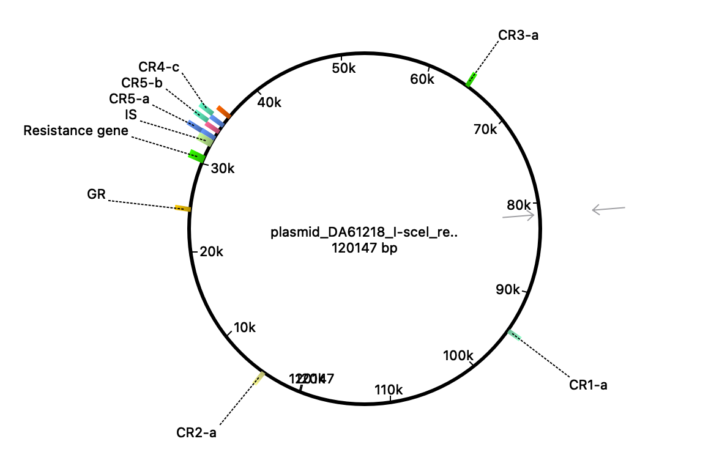

# Nano-CNV project

Code for the project publshed in %journalname%

The main pipeline processes Nanopore reads to find and summarize plasmid *blaSHV-1* copy number distribution.

## The plasmid map



**Resistance gene** - beta-lactamase gene (*blaSHV*); **IS** - insertion sequence/repeat unit; **RR** - "red" flanking region; **GR** - "green" flanking region; **CR** - control regions (1 to 5).

## How to use

The pipeline is written using [Snakemake](https://snakemake.github.io/) v8.23.1 - a workflow management system.
To be able to run the analysis, install Snakemake first (see the official installation instructions).

Ensure that you have input files (Nanopore reads and plasmid sequence) in corresponding directories in `resources/reads` and `resources/plasmid`.

Once everything is in place, run the following command:

```bash
# navigate to the project's directory
# replace $N with number of threads you want to use
snakemake --snakefile workflow/snakefile.smk --use-conda --use-singularity --cores $N 
```

to run the analysis using conda environments inside a container.

## The main rule graph


