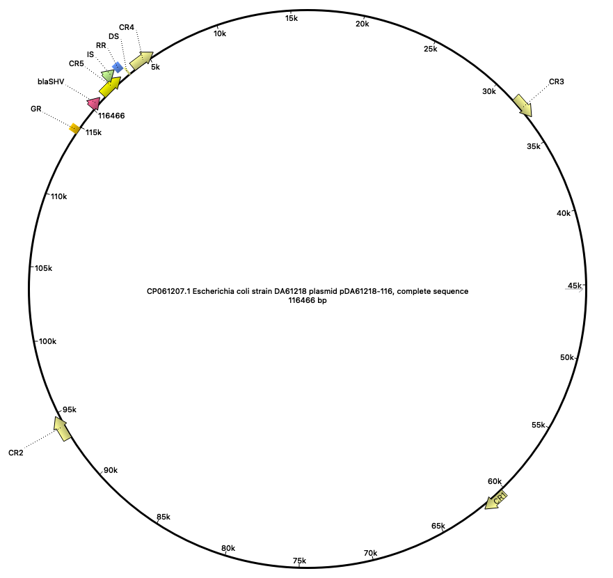
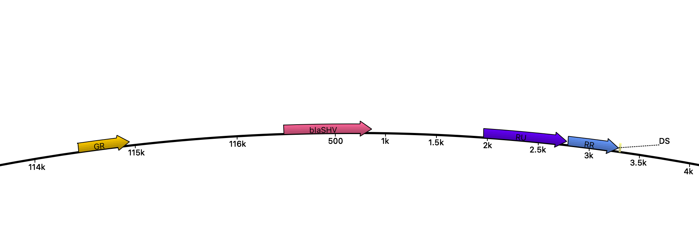

# Nano-CNV project

Code to find and summarize plasmid *blaSHV-1* copy number distribution in bacterial populations

## Map of the plasmid

### Full map

**DS** - digestion site; **blaSHV** - beta-lactamase gene; **IS/RU** - insertion sequence/repeat unit; **RR** - "red" flanking region; **GR** - "green" flanking region; **CR** - control regions (1 to 5).

### Close up of the DS region

## The main rule graph

