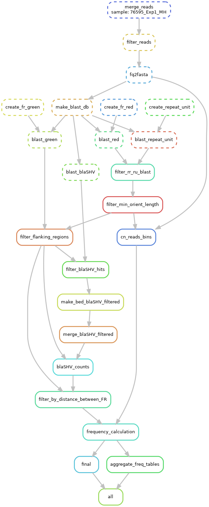

[](https://snakemake.bitbucket.io) 


# Description

This is the code for detecting tandem gene amplifications in ultra-deep Nanopore long read sequencing data at frequencies as low as $10^{-5}$.
The full study and method description will be available soon.

# Dependencies

OS: Ubuntu 22.04.5 LTS

Software:

 - [Snakemake](https://snakemake.readthedocs.io/en/stable/) v8.23.1
 - [R](https://www.r-project.org/) v4.4.0
 - [dplyr](https://dplyr.tidyverse.org/) v1.1.4
 - [readr](https://readr.tidyverse.org/) v2.1.5
 - [purrr](https://purrr.tidyverse.org/) v1.0.2
 - [tidyr](https://tidyr.tidyverse.org/) v1.3.1
 - [Biostrings](https://bioconductor.org/packages/release/bioc/html/Biostrings.html) v2.70.1
 - [Python](https://www.python.org/) v3.12.10
 - [pandas](https://pandas.pydata.org/) v1.5.3 
 - [OpenPyXL](https://openpyxl.readthedocs.io/en/stable/) v3.1.5
 - [BLAST](https://www.ncbi.nlm.nih.gov/books/NBK52640/) v2.12.0
 - [SeqKit](https://bioinf.shenwei.me/seqkit/) v2.0.0
 - [Filtlong](https://github.com/rrwick/Filtlong) v0.2.1
 - [bedtools](https://bedtools.readthedocs.io/en/latest/) v2.30.0
 - [gzip](https://www.gzip.org/) v1.10
 - [pigz](https://zlib.net/pigz/) v2.6

**NB:** Given that you have Snakemake installed, all other dependencies will be installed and deployed automatically when you run the pipeline (see below).

# Input & output

All the input files are described in `config.yaml`:

- path to the TSV file with sample names and corresponding FASTQ files;
- path to the TSV file with the analysis' parameters (see the section below)
- path to the FASTA file with the plasmid sequence;
- path to the FASTA file with the blaSHV gene sequence;
- path to the output file name (without extension);

The output is a TSV text file with observed, expected (theoretical) and corrected gene counts, observed, expected and corrected gene frequency, as well as detection limit for each sample and copy number variant of the gene.

# Usage

## Test run

This repo contains a small dataset which you can use for testing purposes.

To run the pipeline on this dataset, use `test.yaml` configuration file:

```bash
snakemake --use-conda --cores <number_of_cores> --configfile config/test.yaml
```

Depending on your computer it may take some time, but it should not take more than 1 hour.

## Full run

The Nanopore long sequencing data can be found in the NCBI SRA database under the accession number PRJNA1299340.

To run the pipeline on these samples, edit `config/samples.tsv` to include the actual paths to the FASTQ files and then run the pipeline using the `config.yaml` file:

```bash
snakemake --use-conda --cores <number_of_cores> --configfile config/config.yaml
```

# Parameters

The parameters for the analysis are specified in the `params.tsv` file. These parameters are:

- minimum read length: reads shorter than this are discarded from the analysis.
- fr_red_start and fr_red_end: the start and end positions of the flanking region 1.
- fr_green_start and fr_green_end: the start and end positions of the flanking region 2.
- ru_start and ru_end: the start and end positions of the repeat unit (IS element).
- bla_start and bla_end: the start and end positions of the blaSHV gene.
- format: blast output format.
- n_fr_aligns: the number of flanking region alignments to consider.
- n_bla_aligns: the number of blaSHV gene alignments to consider.
- min_fr_len: the minimum length of the flanking region to consider.
- min_identity: the minimum identity BLAST hits to consider.
- max_e_value: the maximum E-value of BLAST hits to consider.
- min_ru_len: the minimum length of the repeat unit to consider.
- max_dist: the maximum distance between the BLAST hits to consider.
- dist_to_end: the distance from the end of the read to the end of the repeat unit to consider.
- max_cn: the maximum copy number of the repeat unit to consider.
- increment: increase in length of the DNA segment with each new blaSHV copy.
- base_len: length of a blaSHV gene for expected  copy number calculation.
- dist: the distance between BLAST hits to use in `bedtools merge`.


# Rule graph


