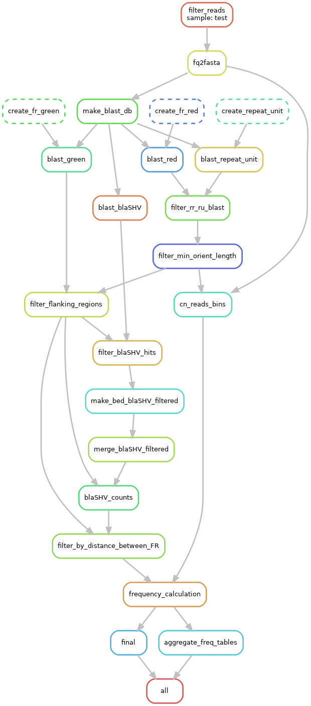

[](https://snakemake.bitbucket.io)  

# Description

This is the code for detecting tandem gene amplifications in ultra-deep Nanopore long read sequencing data at frequencies as low as $10^{-5}$.
The full study and method description will be available soon. Reproducibility of the results is guaranteed by the use of Snakemake, Conda environments and Apptainer containers.

## Input

All the input files are described in `config/config.yaml`:

- path to the TSV file with sample names and corresponding FASTQ files;
- path to the TSV file with the analysis' parameters (see the section below)
- path to the FASTA file with the plasmid sequence;
- path to the FASTA file with the blaSHV gene sequence;
- path to the output file name (without extension);

## Output

The output is a TSV text file with 
- observed, expected (theoretical) and corrected gene counts, 
- observed, expected and corrected gene frequency, 
- detection limit for each sample and 
- copy number variant of the gene.

# Usage

*This pipeline was developed and tested on Ubuntu 22.04 LTS*.

If you don't have `Snakemake` installed, [install it](https://snakemake.readthedocs.io/en/stable/getting_started/installation.html).

You can run the analysis using containers (recommended) or conda environments.

To use containers you need to have both [`Apptainer`](https://apptainer.org/docs/user/main/quick_start.html#installation) and [`Docker`](https://docs.docker.com/engine/install/ubuntu/) installed.

## Preparing containers

If you want to use containers, read [our container build instructions](resources/containers/README.md) how to build them.

## Conda environments

If you want to use conda environments, Snakemake will take care of installing all the dependencies automatically.

## Quick run on the test data

### Using [`Pixi`](https://pixi.prefix.dev/latest/)

To run the workflow using Pixi tasks, you can use the following commands:

1. **Dry Run**: To see what will happen without executing the tasks, run:

   ```bash
   pixi dry-run
   ```

2. **Run with Conda**: To execute the workflow using Conda environments, use:

   ```bash
   pixi run-conda
   ```

3. **Run with Apptainer**: To execute the workflow using Apptainer containers, run:

   ```bash
   pixi run-apptainer
   ```

4. **Generate Rule Graph**: To visualize the workflow rules, execute:

   ```bash
   pixi rulegraph
   ```

5. **Generate DAG**: To create a Directed Acyclic Graph (DAG) of the workflow, use:

   ```bash
   pixi dag
   ```

### Using `Apptainer`

```bash
snakemake --sdm apptainer --configfile config/config.yaml --cores 2 --singularity-args "--bind ${PWD}/config/,${PWD}/results/"
```

or simply

```bash
snakemake --configfile config/config.yaml --profile profiles/apptainer
```

Edit the `profiles/apptainer/config.yaml` file to include the paths to the test dataset and apptainer's cache and tmp directories, if needed.

### Using `conda`

```bash
snakemake --sdm conda --cores 2 --configfile config/config.yaml
```

On a moderately powerful desktop computer, this process takes a couple of minutes to finish.

The results of this run will be saved in two files under `results/tables/` directory: `frequencies_all_test.tsv` and `frequencies_all_test.xlsx`. You can compare them to the expected results in `results/test_dataset/` directory available in this repository.

## Full run

The Nanopore long sequencing data can be found in the NCBI SRA database under the accession number **PRJNA1299340**.

To run the pipeline on these samples, edit `config/samples.tsv` to include absolute paths to the FASTQ files on your computer, then replace

```yaml
sample_table: "config/samples_test.tsv"
```

with

```yaml
sample_table: "config/samples.tsv"
```

and replace

```yaml
output_name: "results/tables/frequencies_test"
```

with

```yaml
output_name: "results/tables/frequencies"
```

Commands to run the pipeline with `Apptainer` and `conda` are the same as for the quick run, except for the `--singularity-args` option: you might need to bind directory with the actual data to the container.

# Parameters

Parameters for the analysis and their values are specified in the `config/params.tsv` file. These parameters are:

- *minimum read length*: reads shorter than this are discarded from the analysis.
- *fr_red_start* and *fr_red_end*: the start and end positions of the flanking region 1.
- *fr_green_start* and *fr_green_end*: the start and end positions of the flanking region 2.
- *ru_start* and *ru_end*: the start and end positions of the repeat unit (IS element).
- *bla_start* and *bla_end*: the start and end positions of the blaSHV gene.
- *format*: blast output format.
- *n_fr_aligns*: the number of flanking region alignments to consider.
- *n_bla_aligns*: the number of blaSHV gene alignments to consider.
- *min_fr_len*: the minimum length of the flanking region to consider.
- *min_identity*: the minimum identity BLAST hits to consider.
- *max_e_value*: the maximum E-value of BLAST hits to consider.
- *min_ru_len*: the minimum length of the repeat unit to consider.
- *max_dist*: the maximum distance between the BLAST hits to consider.
- *dist_to_end*: the distance from the end of the read to the end of the repeat unit to consider.
- *max_cn*: the maximum copy number of the repeat unit to consider.
- *increment*: increase in length of the DNA segment with each new blaSHV copy.
- *base_len*: length of a blaSHV gene for expected  copy number calculation.
- *dist*: the distance between BLAST hits to use in `bedtools merge`.


# Rule graph

## graphviz variant



## [snakevision](https://github.com/OpenOmics/snakevision) variant


# Software used for the analysis

OS: Ubuntu 22.04.5 LTS

Software:

 - [Snakemake](https://snakemake.readthedocs.io/en/stable/) v8.23.1
 - [Apptainer](https://apptainer.org) v1.3.4
 - [R](https://www.r-project.org/) v4.4.3
 - [dplyr](https://dplyr.tidyverse.org/) v1.1.4
 - [readr](https://readr.tidyverse.org/) v2.1.5
 - [purrr](https://purrr.tidyverse.org/) v1.0.2
 - [tidyr](https://tidyr.tidyverse.org/) v1.3.1
 - [Biostrings](https://bioconductor.org/packages/release/bioc/html/Biostrings.html) v2.70.1
 - [Python](https://www.python.org/) v3.12.10
 - [pandas](https://pandas.pydata.org/) v1.5.3 
 - [OpenPyXL](https://openpyxl.readthedocs.io/en/stable/) v3.1.5
 - [BLAST](https://www.ncbi.nlm.nih.gov/books/NBK52640/) v2.12.0
 - [SeqKit](https://bioinf.shenwei.me/seqkit/) v2.0.0
 - [Filtlong](https://github.com/rrwick/Filtlong) v0.2.1
 - [bedtools](https://bedtools.readthedocs.io/en/latest/) v2.30.0
 - [gzip](https://www.gzip.org/) v1.10
 - [pigz](https://zlib.net/pigz/) v2.6
