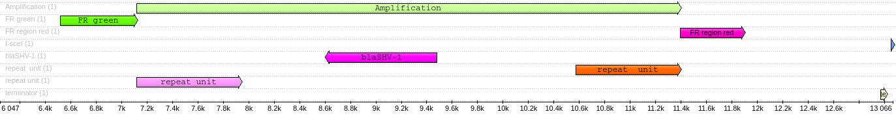

```{r setup, include=FALSE}
knitr::opts_chunk$set(echo = TRUE)
library(tidyverse)
```

# Deep data set

Now I have deeper sequencing and digestion site from which all the reads will begin.



## Overview of reads

### length distribution

```{bash, eval=F}
conda activate snakemake
seqkit watch resources/reads/replicate_e/CNV_reads_all.fastq.gz -O results/reads_stat/replicate_e.png -j 8
```


Try different read min length!

```{bash, eval=FALSE}
# filter out too short reads
conda activate /home/andrei/mambaforge/envs/filtlong-env 
LENGTH="7000"
filtlong --min_length $LENGTH resources/reads/replicate_e/CNV_reads_all.fastq.gz > results/reads_filtered/replicate_e/CNV_reads_all.fastq && pigz -p 12 results/reads_filtered/replicate_e/CNV_reads_all.fastq

# histogram
seqkit watch results/reads_filtered/replicate_e/CNV_reads_all.fastq.gz -O results/reads_stat/replicate_e_min_7k.png -j 8

# convert fastq to fasta
seqkit fq2fa results/reads_filtered/replicate_e/CNV_reads_all.fastq.gz > results/reads_filtered/replicate_e/CNV_reads_all.fasta
```


### Quality distribution

```{bash, eval=F}
seqkit watch results/reads_filtered/replicate_e/CNV_reads_all.fastq.gz -O results/reads_stat/replicate_e_qual.png -j 8 -f MeanQual
```


## Blast the flankig regions 

left = red; right = green

```{bash, eval=F}
# RUN BLAST
#
# -sorthsps <Integer, (>=0 and =<4)>
#   Sorting option for hps:
#     0 = Sort by hsp evalue,
#     1 = Sort by hsp score,
#     2 = Sort by hsp query start,
#     3 = Sort by hsp percent identity,
#     4 = Sort by hsp subject start
#   Not applicable for outfmt != 0
#
# -num_alignments <Integer, >=0>
#   Number of database sequences to show alignments for
#   Default = `250'
#    * Incompatible with:  max_target_seqs

# num_alignments should be high enough, depending on the total number of reads
blastn -query resources/flanking_regions/flanking_region_red.fa -subject results/reads_filtered/replicate_e/CNV_reads_all.fasta -outfmt 6 -num_alignments 333000 -num_threads 10 > results/tables/blast_flanking_region_red.tsv

blastn -query resources/flanking_regions/flanking_region_green.fa -subject results/reads_filtered/replicate_e/CNV_reads_all.fasta -outfmt 6 -num_alignments 333000 -num_threads 10 > results/tables/blast_flanking_region_green.tsv
```


## Parse BLAST results

### Red

reads of interest should contain 'red' segment at their start, not in their middle.

if a 'red' segment resides far from one of the ends, then this read should be discarded.

#### Distance to reads' ends

```{r, message=FALSE, warning=FALSE}
blast_red <- read_delim("../results/tables/blast_flanking_region_red.tsv", col_names = F)

names(blast_red) <- c("query", "subject", "identity", "length", "mismatch", 
                        "gaps", "start.query", "end.query", "start.subject", 
                        "end.subject", "e.value", "bit.score")

blast_red %>%
  ggplot(aes(start.subject)) +
  geom_histogram(bins = 150)
```

```{r}
blast_red %>%
  select(start.subject) %>% 
  summary()
```

So, there are hits (start.subject) very far from one of the read's ends.
But how far are they from the other end?
read length is required!

On the other hand, the majority of reads have a hit within 2000 bp from one of the ends:

```{r}
blast_red %>% 
  filter(start.subject < 2000) %>%
  nrow()
```

```{r}
blast_red %>% 
  filter(start.subject < 1000) %>%
  nrow()
```

```{r}
blast_red %>% 
  filter(start.subject < 3000) %>%
  nrow()
```

less than 200 reads have ends at a distance between 3000 and 2000 from one end.

Maybe, we can omit the reads that have hits beyond than 2000 bp?

Of those, I can keep only the reads containing both green and red segments (my former approach), then count the distance between them.


```{r}
blast_red %>%
  filter(start.subject < 2000) %>% 
  select(start.subject) %>% 
  summary()
```

#### Multiple hits in one read

Do we have them?

```{r}
blast_red %>% 
  group_by(subject) %>% 
  count() %>% 
  arrange(-n)
```

```{r}
blast_red %>% 
  group_by(subject) %>% 
  count() %>% 
  filter(n > 1) %>% 
  nrow()
```

share of reads with multiple hits: `r (blast_red %>% group_by(subject) %>% count() %>% filter(n > 1) %>% nrow())/nrow(blast_red)`

We will filter them out

Multiple hits among the reads with max. end distance 2000 bp

```{r}
blast_red %>% 
  filter(start.subject < 2000) %>%
  group_by(subject) %>% 
  count() %>% 
  arrange(-n)
```

share of such reads: `r (blast_red %>% filter(start.subject < 2000) %>% group_by(subject) %>% count() %>% filter(n > 1) %>% nrow())/nrow(blast_red %>% filter(start.subject < 2000))`

#### Query length

```{r}
blast_red %>% 
  select(length) %>% 
  summary()
```

```{r}
ggplot(blast_red, aes(length)) +
  geom_histogram(bins = 150)
```

query length < 400 is suspiciously short

We can easily filter out queries shorter than 500 bp

#### E-value and query length

```{r}
blast_red %>% 
  ggplot(aes(e.value)) + 
  geom_histogram(bins = 150)
```

There is no positive e-values

#### Identity

```{r}
ggplot(blast_red, aes(identity)) +
  geom_histogram(bins = 150)
```

Looks ok

#### Filtering

1. Filter out reads with the 'red' segment located too far

2. Filter out query hits that are shorter than 500 bp

3. Filter out multiple hits

```{r}
blast_red_filt <- 
  blast_red %>% 
  filter(start.subject < 2000,
         length > 500)
```

Any multiple hits left?

```{r}
blast_red_filt %>% 
  group_by(subject) %>% 
  count() %>% 
  filter(n > 1)
```

#### Strand indicator

```{r}
blast_red_filt <-
  blast_red_filt %>% 
  mutate(strand = if_else(start.subject > end.subject, "neg", "pos"))

blast_red_filt %>% 
  group_by(strand) %>% 
  count()
```


### Green

#### Filtering

Apply the same filtering here, except for 'shortest end distance'

2. Filter out query hits that are shorter than 500 bp

3. Filter out multiple hits

```{r, message=FALSE, warning=FALSE}
blast_green <- read_delim("../results/tables/blast_flanking_region_green.tsv", col_names = F)

names(blast_green) <- c("query", "subject", "identity", "length", "mismatch", 
                        "gaps", "start.query", "end.query", "start.subject", 
                        "end.subject", "e.value", "bit.score")

blast_green %>% 
  ggplot(aes(length)) +
  geom_histogram(bins = 150)
```

```{r}
blast_green %>% 
  select(length) %>% 
  summary()
```


Query length filter

```{r}
blast_green_filt <- 
  blast_green %>% 
  filter(length > 500)
```

Any multiple hits left?

```{r}
blast_green_filt %>% 
  group_by(subject) %>% 
  count() %>% 
  filter(n > 1)
```

share of rows with multiple hits: `r (blast_green_filt %>% group_by(subject) %>% count() %>% filter(n > 1) %>% nrow())/nrow(blast_green_filt)`

```{r}
blast_green_filt %>% 
  group_by(subject) %>% 
  count() %>% 
  arrange(-n)
```

Filter them out:

```{r}
reads_multy_hits <- 
  blast_green_filt %>% 
  group_by(subject) %>% 
  count() %>% 
  filter(n > 1)

blast_green_filt <- 
  blast_green_filt %>% 
  filter(!(subject %in% reads_multy_hits$subject))

nrow(blast_green_filt)
```

#### Strand indicator

```{r}
blast_green_filt <-
  blast_green_filt %>% 
  mutate(strand = if_else(start.subject > end.subject, "neg", "pos"))

blast_green_filt %>% 
  group_by(strand) %>% 
  count()
```

## Join red & green

Use `full_join()` to retain all combinations of query hits on all the reads

```{r}
blast_joined <- full_join(blast_red_filt, blast_green_filt, by = "subject")

blast_joined
```

There are reads containing only 'red', only 'green' and both, and those that contain both 'red' and 'green' on the same strand.

1. Have 'green' but not 'red'

```{r}
# 'smth.x' comes from blast_red
# 'smth.y' comes from blast_green
blast_joined %>% 
  filter(is.na(query.x)) %>% 
  nrow()
```

2. Have 'red' but not 'green'

```{r}
blast_joined %>% 
  filter(is.na(query.y)) %>% 
  nrow()
```

From blast tables I can not tell how many copies of the gene I have there... Unless I blast the gene against these reads.

3. Have both 'red' and 'green'

```{r}
blast_joined %>% 
  filter(!is.na(query.y), !is.na(query.x)) %>% 
  nrow()
```

## CN distribution in reads containing both 'red' and 'green'

```{r}
# FIND CNV
n_copies <- blast_joined %>% 
  filter(!is.na(query.y), 
         !is.na(query.x)) %>% 
  mutate(n.copies = round(abs(start.subject.y - end.subject.x) / 3500)) 

# PLOT
ggplot(n_copies, aes(n.copies)) + 
  geom_histogram(bins=100, fill = "steelblue") + 
  geom_rug() +
  xlab("n copies") +
  ggtitle("BL-genes copy number distribution", subtitle = paste0("N reads spanning the region: ", nrow(n_copies)))
```

```{r}
n_copies %>% 
  group_by(n.copies) %>% 
  count()
```


