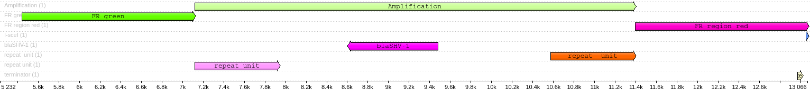

```{r setup, include=FALSE}
knitr::opts_chunk$set(echo = TRUE)
library(tidyverse)
```

## Scheme of the region of interest

Compared to part 2, here I use longer both red and green regions. 
For the red one I will use all available length (1677 bp). 
The green region will have the same length.



## Overview of reads

replicate E

### Length distribution

```{bash, eval=F}
conda activate snakemake
seqkit watch resources/reads/replicate_e/CNV_reads_all.fastq.gz -O results/reads_stat/replicate_e.png -j 8
```


Filter out all reads shorter than 3.7 Kb (FR+IS+FR) - minimal read length that can capture 0 CN variants consisting only of two FRs and one IS copy between them.

Precise length FR+IS+FR = 3756.6

```{bash, eval=FALSE}
# filter out too short reads
conda activate /home/andrei/mambaforge/envs/filtlong-env 
LENGTH="3757"
filtlong --min_length $LENGTH resources/reads/replicate_e/CNV_reads_all.fastq.gz > results/reads_filtered/replicate_e/CNV_reads_all_3.7k.fastq && pigz -p 12 results/reads_filtered/replicate_e/CNV_reads_all_3.7k.fastq
conda deactivate

# histogram
seqkit watch results/reads_filtered/replicate_e/CNV_reads_all_3.7k.fastq.gz -O results/reads_stat/replicate_e_min_3.7k.png -j 8

# convert fastq to fasta
seqkit fq2fa results/reads_filtered/replicate_e/CNV_reads_all_3.7k.fastq.gz > results/reads_filtered/replicate_e/CNV_reads_all_3.7k.fasta
```


### Quality distribution

of reads longer than 3.7k

```{bash, eval=F}
seqkit watch results/reads_filtered/replicate_e/CNV_reads_all_3.7k.fastq.gz -O results/reads_stat/replicate_e_qual_min3.7.png -j 8 -f MeanQual
```


## Blast the flankig regions 

left = red; right = green

```{bash, eval=F}
# RUN BLAST
#
# -sorthsps <Integer, (>=0 and =<4)>
#   Sorting option for hps:
#     0 = Sort by hsp evalue,
#     1 = Sort by hsp score,
#     2 = Sort by hsp query start,
#     3 = Sort by hsp percent identity,
#     4 = Sort by hsp subject start
#   Not applicable for outfmt != 0
#
# -num_alignments <Integer, >=0>
#   Number of database sequences to show alignments for
#   Default = `250'
#    * Incompatible with:  max_target_seqs

# num_alignments should be high enough, depending on the total number of reads
blastn -query resources/flanking_regions/flanking_region_red_1677.fa -subject results/reads_filtered/replicate_e/CNV_reads_all_3.7k.fasta -outfmt 6 -num_alignments 450000 > results/tables/blast_flanking_region_red.tsv

blastn -query resources/flanking_regions/flanking_region_green_1677.fa -subject results/reads_filtered/replicate_e/CNV_reads_all_3.7k.fasta -outfmt 6 -num_alignments 450000 > results/tables/blast_flanking_region_green.tsv
```

## Parse BLAST results

### Red

reads of interest should contain 'red' segment at their start

```{r, message=FALSE, warning=FALSE}
blast_red <- read_delim("../results/tables/blast_flanking_region_red.tsv", col_names = F)

names(blast_red) <- c("query", "subject", "identity", "length", "mismatch", 
                        "gaps", "start.query", "end.query", "start.subject", 
                        "end.subject", "e.value", "bit.score") 
blast_red <- 
  blast_red %>%
  mutate(orientation = if_else(start.subject < end.subject, "direct", "reverse"))

# rename query
blast_red$query <- "FR_red"

blast_red
```

#### Number of hits

```{r}
# rows with the same subject
blast_red %>% 
  group_by(subject) %>% 
  count() %>% 
  ggplot(aes(n)) + 
  geom_histogram(bins = 150, fill="darkred") +
  geom_rug()
```

In plain numbers:

Total number of reads with red hits: `r length(unique(blast_red$subject))` of which `r blast_red %>% group_by(subject) %>% count() %>% filter(n > 1) %>% nrow()` have more than 1 hit, `r t <- length(unique(blast_red$subject)); m <- blast_red %>% group_by(subject) %>% count() %>% filter(n > 1) %>% nrow(); round(m/t, 3)*100`%

Vast majority of hits has only one red hit per read.

Some hits may represent a 'good' but fragmented hit.

If we filter out all the reads containing more than 1 hit including such fragmented reads, we loose just a fraction of data.

#### Number of hits & orientation

```{r}
# rows with the same subject
blast_red %>% 
  group_by(subject, orientation) %>% 
  count() %>% 
  ggplot(aes(n)) + 
  geom_histogram(bins = 150, fill="darkred") +
  geom_rug() +
  facet_grid(rows = vars(orientation))
```

#### Hit lengths

```{r}
blast_red %>%
  ggplot(aes(length)) +
  geom_histogram(bins = 150, fill='darkred') 
```

Number of query hits shorter than 1500: `r blast_red %>% filter(length < 1500) %>% nrow()`

Number of query hits longer than 1500: `r blast_red %>% filter(length > 1500) %>% nrow()`

#### Hit identity

```{r}
blast_red %>%
  ggplot(aes(identity)) +
  geom_histogram(bins = 150, fill='darkred') 
```

Number of query hits with identity below 75%: `r blast_red %>% filter(identity < 75) %>% nrow()`

Number of query hits with identity above 75%: `r blast_red %>% filter(identity >= 75) %>% nrow()`

#### E-value

```{r}
blast_red %>%
  ggplot(aes(log10(e.value))) +
  geom_histogram(bins = 150, fill='darkred') 
```

```{r}
blast_red %>%
  filter(e.value != 0) %>% 
  ggplot(aes(log10(e.value))) +
  geom_histogram(bins = 150, fill='darkred') +
  ggtitle("e-value = 0 excluded")
```

Query hits with e-value above $ 10^-5$

```{r}
blast_red %>% 
  filter(e.value > 10**-5) %>% 
  nrow()
```

Also, these have very short lengths

```{r}
blast_red %>% 
  filter(e.value > 10**-5) %>% 
  select(length)
```

Remaining hits are reliable

#### Length vs Identity vs E-value

```{r}
blast_red %>% 
  ggplot(aes(length, identity)) +
  geom_point(aes(color=e.value)) +
  ggtitle("query hits raw")
```

Filtering criteria: 

- length > 1500
- e-value < 10**-5
- identity >= 75%

```{r}
blast_red %>% 
  filter(length > 1500,
         e.value < 10**-5,
         identity >= 75) %>% 
  ggplot(aes(length, identity)) +
  geom_point(aes(color=e.value)) +
  ggtitle("query hits filtered")
```

### Green

```{r, message=FALSE, warning=FALSE}
blast_green <- read_delim("../results/tables/blast_flanking_region_green.tsv", col_names = F)

names(blast_green) <- c("query", "subject", "identity", "length", "mismatch", 
                        "gaps", "start.query", "end.query", "start.subject", 
                        "end.subject", "e.value", "bit.score")
blast_green <- 
  blast_green %>%
  mutate(orientation = if_else(start.subject < end.subject, "direct", "reverse"))

blast_green$query <- "FR_green"

blast_green
```


#### Number of hits

```{r}
# rows with the same subject
blast_green %>% 
  group_by(subject) %>% 
  count() %>% 
  ggplot(aes(n)) + 
  geom_histogram(bins = 30, fill="darkgreen") +
  geom_rug() +
  xlab("n hits per read")
```

In plain numbers:

Total number of reads with red hits: `r length(unique(blast_green$subject))` of which `r blast_green %>% group_by(subject) %>% count() %>% filter(n > 1) %>% nrow()` have more than 1 hit, `r t <- length(unique(blast_green$subject)); m <- blast_green %>% group_by(subject) %>% count() %>% filter(n > 1) %>% nrow(); round(m/t, 3)*100`%

That's a lot, we shouldn't just filter out all the reads containing multiple green hits.

#### Number of hits & orientation

```{r}
# rows with the same subject
blast_green %>% 
  group_by(subject, orientation) %>% 
  count() %>% 
  ggplot(aes(n)) + 
  geom_histogram(bins = 30, fill="darkgreen") +
  geom_rug() +
  facet_grid(rows = vars(orientation))
```

#### Hit length

```{r}
blast_green %>%
  ggplot(aes(length)) +
  geom_histogram(bins = 150, fill='darkgreen') 
```

Number of query hits shorter than 1500: `r blast_green %>% filter(length < 1500) %>% nrow()`

Number of query hits longer than 1500: `r blast_green %>% filter(length > 1500) %>% nrow()`

```{r}
blast_green %>% filter(length < 1500)
```

#### Identity

```{r}
blast_green %>%
  ggplot(aes(identity)) +
  geom_histogram(bins = 150, fill='darkgreen') 
```

Number of query hits with identity below 75%: `r blast_green %>% filter(identity < 75) %>% nrow()`

Number of query hits with identity above 75%: `r blast_green %>% filter(identity >= 75) %>% nrow()`

#### E-value

```{r}
blast_green %>%
  ggplot(aes(e.value)) +
  geom_histogram(bins = 150, fill='darkgreen') 
```

```{r}
blast_green %>%
  filter(e.value != 0) %>% 
  ggplot(aes(log10(e.value))) +
  geom_histogram(bins = 150, fill='darkgreen') +
  ggtitle("e-value = 0 excluded")
```

Query hits with e-value above $ 10^-5$

```{r}
blast_green %>% 
  filter(e.value > 10**-5) %>% 
  nrow()
```

Remaining hits are reliable

#### Length vs Identity vs E-value

```{r}
blast_green %>% 
  ggplot(aes(length, identity)) +
  geom_point(aes(color=e.value)) +
  ggtitle("query hits raw")
```

After filtering: 

- length > 1500
- e-value < 10**-5
- identity >= 75%

```{r}
blast_green %>% 
  filter(length > 1500,
         e.value < 10**-5,
         identity >= 75) %>% 
  ggplot(aes(length, identity)) +
  geom_point(aes(color=e.value)) +
  ggtitle("query hits filtered")
```

The plot looks very similar to the one with 'red' query hits

## Filtering 1: length, e-value, identity

BLAST results filtering criteria for both *red* and *green* FRs

- length > 1500
- e-value < 10**-5
- identity >= 75%

After this round of filtering many multiple hits might be gone. Let's check.

```{r}
blast_red_filt <-
  blast_red %>%
  filter(length > 1500,
         e.value < 10 ** -5,
         identity >= 75)

blast_green_filt <-
  blast_green %>%
  filter(length > 1500,
         e.value < 10 ** -5,
         identity >= 75)
```

### Multiple hits per read?

#### Red

```{r}
blast_red_filt %>% 
  group_by(subject) %>% 
  count() %>% 
  ggplot(aes(n)) + 
  geom_histogram(bins = 150, fill="darkred") +
  geom_rug()
```

In plain numbers:

Total number of reads with red hits: `r length(unique(blast_red_filt$subject))` of which `r blast_red_filt %>% group_by(subject) %>% count() %>% filter(n > 1) %>% nrow()` have more than 1 hit, `r t <- length(unique(blast_red_filt$subject)); m <- blast_red_filt %>% group_by(subject) %>% count() %>% filter(n > 1) %>% nrow(); round(m/t, 3)*100`%

Lets look at the reads with multiple hits

```{r}
blast_red_filt %>% 
  group_by(subject) %>% 
  count() %>% 
  filter(n > 1) %>% 
  left_join(blast_red_filt, by = "subject") %>% 
  select(subject, start.subject, end.subject, orientation)
```

#### Green

```{r}
blast_green_filt %>% 
  group_by(subject) %>% 
  count() %>% 
  ggplot(aes(n)) + 
  geom_histogram(bins = 150, fill="darkgreen") +
  geom_rug()
```

In plain numbers:

Total number of reads with red hits: `r length(unique(blast_green_filt$subject))` of which `r blast_green_filt %>% group_by(subject) %>% count() %>% filter(n > 1) %>% nrow()` have more than 1 hit, `r t <- length(unique(blast_green_filt$subject)); m <- blast_green_filt %>% group_by(subject) %>% count() %>% filter(n > 1) %>% nrow(); round(m/t, 3)*100`%

This looks much better now. We can discard this fraction of reads from the analysis.

## Filtering 2: multiple hits, single hits, orientation etc

Filter out:

- reads with multiple green/red regions detected
- reads with only one red or green hit
- reads with different orientation of the flanking regions
- reads without full blaSHV genes in between the flanking regions 
or/and -> requires more blasting and subsequent analysis 
- reads with 'wrong' number of repeats between the flanking regions -> divide distance by AU length

### Filter out reads with multiple hits

```{r}
# a function to get IDs of reads with multiple hits of the same 'color'
get_multihits_ids <- function(df){
  # df: filtered blast table
  df %>% 
  group_by(subject) %>% 
  count() %>% 
  filter(n > 1) %>% 
  pull(subject)
}

reads_multiple_hits <- union(get_multihits_ids(blast_red_filt), 
                             get_multihits_ids(blast_green_filt))
```

There are `r length(reads_multiple_hits)` reads with multiple hits

Remove these reads

```{r}
blast_red_filt <- 
  blast_red_filt %>% 
  filter(!subject %in% reads_multiple_hits)

blast_green_filt <-
  blast_green_filt %>% 
  filter(!subject %in% reads_multiple_hits)
```


### Filter out reads with single hits

First, join the tables by subject (read ID)
Then, remove reads with 'lonely' FRs

```{r}
blast_joined <- 
  full_join(blast_red_filt, blast_green_filt, by = "subject")

# reads with only one flanking region should have NA in query.x or query.y
```

That's how many reads with single FRs there are: `r blast_joined %>% filter(is.na(query.x) | is.na(query.y)) %>% nrow()`

Remove them

```{r}
blast_joined_filt <-
  blast_joined %>% 
  filter(!is.na(query.x), 
         !is.na(query.y))
```

That's how many reads left: `r length(unique(blast_joined_filt$subject))`

### Filter by orientation

`orientation.x` and `orientation.y` should match

There are `r blast_joined_filt %>% filter(orientation.x != orientation.y) %>% select(contains('query'), contains('orientation')) %>% nrow()` reads with non-matching orientation of the FRs

Remove them

```{r}
blast_joined_filt <-
  blast_joined_filt %>%
  filter(orientation.x == orientation.y)
```

That many reads left: `r nrow(blast_joined_filt)`

### Filter by number of AUs

using distance between the FRs

```{r}
blast_joined_filt <- blast_joined_filt %>% 
  mutate(green.red.distance = end.subject.x - start.subject.y) 

blast_joined_filt %>% 
  ggplot(aes(green.red.distance)) +
  geom_histogram(bins = 100, fill='steelblue') +
  geom_rug() +
  facet_grid(rows = vars(orientation.x)) +
  xlab("distance between FRs")
```

Make distance bewteen the FRs positive

```{r}
blast_joined_filt %>% 
  mutate(green.red.distance.2 = if_else(green.red.distance < 0, green.red.distance * -1, green.red.distance * 1)) %>%
  ggplot(aes(green.red.distance.2)) +
  geom_histogram(bins = 200, fill='steelblue') +
  geom_rug() +
  xlab("distance between FRs")
```

These distances should reflect the copy number variation.

## Length of the reads

```{r, message=FALSE}
library(Biostrings)

file_path <- "../results/reads/replicate_e/reads_all.fasta" 

# Read the file
reads <- readDNAStringSet(file_path)
read_lengths <- width(reads)

reads_len_df <- tibble("subject" = sub("^(.*?) runid=.*", "\\1", names(reads)), 
                       "read.len" = read_lengths)

ggplot(reads_len_df, aes(read.len)) +
  geom_histogram(bins = 300, fill = "steelblue") +
  ggtitle("all reads") +
  xlab("read length")
```

Join this table with filtered blast results and check the length distribution

```{r}
blast_joined_filt <- left_join(blast_joined_filt,
                               reads_len_df,
                               by = "subject")

blast_joined_filt %>% 
  ggplot(aes(read.len)) +
  geom_histogram(bins = 300, fill = "steelblue") +
  ggtitle("filtered reads") +
  xlab("read length")
```

## Length of the reads & distance between FRs

```{r}
blast_joined_filt <-
  blast_joined_filt %>% 
  mutate(green.red.distance.pos = if_else(green.red.distance < 0, green.red.distance * -1, green.red.distance * 1)) 

blast_joined_filt %>% 
  ggplot(aes(green.red.distance.pos, read.len)) +
  geom_point(alpha=0.3) +
  xlab("Distance between FRs") +
  ylab("read length")
```


## BLASTing the blaSHV genes

I can just blast all reads together, then *analyse* the results and join them with FR blast table

```{bash, eval=FALSE}
# requires ca. 23 Gb of RAM
blastn -query resources/genes/blaSHV.fa -subject results/reads_filtered/replicate_e/CNV_reads_all_3.7k.fasta -outfmt 6 -num_alignments 5000000 -num_threads 4 > results/tables/blast_blaSHV.tsv
```

Read the blast results and leave only the reads that have been selected during the previous steps

```{r, message=FALSE, warning=FALSE}
blast_blaSHV <- read_delim("../results/tables/blast_blaSHV.tsv", col_names = F) %>% 
  # leave only the reads in filtered FR blast
  filter(X2 %in% unique(blast_joined_filt$subject)) %>% 
  # remove unreliable hits
  filter(X11 > 10*-5)

names(blast_blaSHV) <- c("query", "subject", "identity", "length", "mismatch", 
                        "gaps", "start.query", "end.query", "start.subject", 
                        "end.subject", "e.value", "bit.score") 
blast_blaSHV
```

### blaSHV hits lengths

```{r}
blast_blaSHV %>% 
  ggplot(aes(length)) +
  geom_histogram(bins = 300, fill = "darkslategray4") +
  geom_rug()
```

### blaSHV hits identity

```{r}
blast_blaSHV %>% 
  ggplot(aes(identity)) +
  geom_histogram(bins = 300, fill = "darkslategray4") +
  geom_rug()
```

### blaSHV hits gaps

```{r}
blast_blaSHV %>% 
  ggplot(aes(gaps)) +
  geom_histogram(bins = 50, fill = "darkslategray4") +
  geom_rug()
```

```{r}
blast_blaSHV %>% 
  ggplot(aes(gaps, identity)) +
  geom_point(alpha = 0.3, color = "darkslategray4")
```


### How many blaSHV hits per read?

```{r}
blast_blaSHV %>% 
  group_by(subject) %>% 
  count() %>% 
  ggplot(aes(n)) +
  geom_histogram(bins = 100, fill = "darkslategray4") +
  geom_rug()
```

This histogram corresponds to the previous plot (read length vs distance between FRs) and the distributions of distances between FRs.

But this plot **is not** the number of blaSHV copies between FRs.

To get it summarize the length of blaSHV hits.

### Three plots together

```{r, fig.height=8}
library(patchwork)

bla_len <- 860

hist.n.bla <- blast_blaSHV %>% 
  group_by(subject) %>% 
  summarise(sum.bla.hit.len = sum(length)) %>% 
  mutate(n.blaSHV = round(sum.bla.hit.len/bla_len)) %>% 
  ggplot(aes(n.blaSHV)) +
  geom_histogram(bins = 100, fill = "darkslategray4") +
  geom_rug() +
  xlab("n blaSHV")

hist.dist.FR <- blast_joined_filt %>%
  mutate(
    green.red.distance.2 = if_else(
      green.red.distance < 0,
      green.red.distance * -1,
      green.red.distance * 1
    )
  ) %>%
  ggplot(aes(green.red.distance.2)) +
  geom_histogram(bins = 200, fill = 'steelblue') +
  geom_rug() +
  xlab("distance between FRs")

point.len.dist <- blast_joined_filt %>%
  ggplot(aes(green.red.distance.pos, read.len)) +
  geom_point(alpha = 0.3) +
  xlab("distance between FRs") +
  ylab("read length")


hist.n.bla / hist.dist.FR / point.len.dist
```


Maybe blaSHV hits are shorter on the reads with only two blaSHV copies?

### read length & number of blaSHV

```{r}
blaSHV_hit_mean_len <- 
  blast_blaSHV %>% 
  group_by(subject) %>% 
  summarise(mean.bla.hit.len = mean(length)) 

bla_len <- 860

blaSHV_counts <- 
  blast_blaSHV %>% 
  group_by(subject) %>% 
  summarise(sum.bla.hit.len = sum(length)) %>% 
  mutate(n.blaSHV = round(sum.bla.hit.len/bla_len))


left_join(blaSHV_hit_mean_len, blaSHV_counts, by = "subject") %>% 
  mutate(n.blaSHV = as_factor(n.blaSHV)) %>% 
  ggplot(aes(n.blaSHV, mean.bla.hit.len)) +
  geom_jitter(alpha=0.3, size = 0.5, height = 0.05) +
  xlab("n blaSHV (sum hits/860)")
```


Extract the names of the reads with N *blaSHV* copies

```{r}
N <- 2

left_join(blaSHV_hit_mean_len, blaSHV_counts, by = "subject") %>% 
  filter(n.blaSHV == 1)
```

use seqkit grep -p %read_id% to extract the read by id

Try other view:

```{r}
left_join(blast_blaSHV, blaSHV_counts, by = "subject") %>% 
  mutate(n.blaSHV = as_factor(n.blaSHV)) %>% 
  ggplot(aes(n.blaSHV, length)) +
  geom_boxplot(outlier.size = 0.2, outlier.alpha = 0.3) +
  ylab("bla hit length") +
  xlab("n blaSHV")
```

But these short lengths are just short hits, we don't count them as *blaSHV* copies anymore, we merge them together instead


## blaSHV genes and the distance between FRs

Theoretical length of the amplified region:

$\hat{d}=\hat{n}_{bla}+2l_{FR}+l_{IS}$

Observed number of *blaSHV* genes:

$\hat{n}_{bla}=\sum_{i=1}^N l_i$

Observed length of the amplified region:

$d=loc_{FR1} - loc_{FR2}$

Linear relationship between theoretical and observed lengths:

$\hat{d}=ad$

Linear relationship between theoretical and observed number of *blaSHV* genes:

$\hat{n}_{bla}=bn_{bla}$


### Plot: n.blaSHv v distance

```{r}
# join bla counts and ain blast table containing gree.red.distance
blast_joined_filt <- 
  left_join(blast_joined_filt, 
            blaSHV_counts, 
            by = "subject") %>% 
  mutate(n.blaSHV = replace_na(n.blaSHV, 0))

# exp. dist vs obs. dist
FR <- 1677
IS <- 820
len_bla <- 860


blast_joined_filt %>%
  mutate(predicted.distance = n.blaSHV*3450+820+1677*2) %>% 
  ggplot(aes(n.blaSHV, green.red.distance.pos)) +
  geom_point(alpha = 0.3, color = "brown4") +
  geom_line(aes(y = predicted.distance), color = "blue") +
  geom_smooth(method="lm", lty=3, color="black") +
  xlab("n blaSHV genes (sum of hits / 860)") +
  ylab("distance between FRs")
```

the blue line - distance predicted using blaSHV counts (sum hits/860)
dashed line - linear regression `n.blaSHV ~ FR distance`s

Extract some reads (on and off the line)

```{r}
blast_joined_filt %>%
  mutate(predicted.distance = n.blaSHV*3450+820+1677*2) %>% 
  filter(n.blaSHV == 7, green.red.distance.pos > 20000) %>% 
  select(subject, green.red.distance.pos, predicted.distance) %>% 
  arrange(green.red.distance.pos)

```

Parse and save reads

```{python, eval=F}
from Bio import SeqIO
import os

# Define the output names array
output_names = [0, 0, 1, 1, 2, 2, 3, 3, 4, 4, 4, 5, 5, 6, 7]

def read_ids(file_path):
    """Read IDs from a file, skipping commented lines."""
    ids = []
    with open(file_path, 'r') as file:
        for line in file:
            line = line.strip()
            if not line.startswith('#') and line:  # Skip commented or empty lines
                ids.append(line)
    return ids

def extract_reads(fasta_file, ids, output_dir):
    """Extract reads from a FASTA file using Biopython and save them to separate files."""
    if not os.path.exists(output_dir):
        os.makedirs(output_dir)  # Create the output directory if it doesn't exist
    
    for record in SeqIO.parse(fasta_file, "fasta"):
        if record.id in ids:
            save_read(record, output_dir, ids)

def save_read(record, output_dir, ids):
    """Save a read to a file named based on the output names array and the length of the read."""
    try:
        output_index = ids.index(record.id)
        output_name = f"{output_names[output_index]}_{len(record.seq)}.fasta"
        output_path = os.path.join(output_dir, output_name)
        with open(output_path, 'w') as output_file:
            SeqIO.write(record, output_file, "fasta")
    except ValueError:
        print(f"ID {record.id} not found in the list of IDs.")

# Paths
ids_file = '/home/andrei/Data/nano-cnv/results/extracted_reads/reads_on_off_regr_line.txt'
fasta_file = '/home/andrei/Data/nano-cnv/results/reads/replicate_e/reads_all.fasta'
output_dir = '/home/andrei/Data/nano-cnv/results/extracted_reads/reads_on_off_regr_line'

# Extract and save reads
ids = read_ids(ids_file)
extract_reads(fasta_file, ids, output_dir)

```


### Poisson regression?

Idea: if PR works (i.e. predictors are significant and assumptions are fulfilled), then we can say that distance between FR indeed corresponds the *blaSHV* count (sum of blast hits).

```{r}
fit  <- glm(n.blaSHV ~ green.red.distance.pos, data = blast_joined_filt, family = "poisson")
summary(fit)
```

Coefficients exponentiation:

```{r}
exp(coef(fit))
```

Check deviance:

```{r}
qcc::qcc.overdispersion.test(blast_joined_filt$n.blaSHV, type="poisson")
```

No over-dispersion: observed dispersion of the data is not greater than the expected one

### SUm of bla hits & FR distance

```{r}
blast_joined_filt %>%
  ggplot(aes(green.red.distance.pos, sum.bla.hit.len)) +
  geom_point(alpha = 0.3, color = "brown4") +
  geom_smooth(method = "lm", lty = 3, color = "black")
```


### Filter out suspiciously short distances

If a FR-FR distance is way too short for the observed number of *blaSHV*, remove such observations from the analysis.

those faulty distances are such that deviate more tha 10% of theoretical in both directions

```{r}
dist_marg <- 0.1
spacer <- 700

blast_joined_filt %>%
  #mutate(dist.expected = n.blaSHV*len_bla + 2*FR + 2*IS + 2*spacer) %>% 
  mutate(dist.expected = n.blaSHV*3450 + 820) %>%
  ggplot(aes(green.red.distance.pos, n.blaSHV)) +
  geom_point(alpha = 0.3, color = "steelblue") +
  geom_vline(aes(xintercept = dist.expected - dist_marg*dist.expected)) +
  geom_vline(aes(xintercept = dist.expected + dist_marg*dist.expected, color=dist.expected), linetype="dotdash") +
  xlab("distance between FRs with +/- 10% margins") +
  ylab("n blaSHV")
```

## blaSHV clusters

The idea is to find blaSHV blast hits clusters and count them as blaSHV copies.

Additionally, we can look into the size of these clusters. 

I need bedtools for this https://bedtools.readthedocs.io/en/latest/content/tools/cluster.html

1. Make a bed file (chrom - start - end - name - score - strand)
2. Sort it
3. Run bedtools cluster

```{r}
bla_bed_mix <- 
  blast_blaSHV %>% 
  select(subject, start.subject, end.subject, query, e.value) %>% 
  mutate(strand = if_else(start.subject < end.subject, '+', '-'),
         start = start.subject - 1,
         end = end.subject - 1) %>% 
  dplyr::rename("chrom" = subject,
                "name" = query,
                "score" = e.value) %>% 
  select(chrom, start, end, name, score, strand)

# swap start and end on negative stands and join with positive strands
bla_bed <- bla_bed_mix %>% 
  filter(strand == '-') %>% 
  dplyr::rename("start" = end,
         "end" = start) %>% 
  select(chrom, start, end, name, score, strand) %>% 
  bind_rows(bla_bed_mix %>% filter(strand == '+'))


write_tsv(bla_bed, "/home/andrei/Data/nano-cnv/notebooks/bedfiles/blaSHV.bed", col_names = F)

# number of obs
bla_bed %>% nrow()
```


### Distance & N clusters

Find using BEDtools merge

```{bash, eval=F}
distances=("10" "50" "100" "150" "200" "300" "500" "800" "1000")

for dist in $distances; do
  obs=$(bedtools cluster -i blaSHV_sorted.bed -s -d $dist | cut -f7 | uniq | wc -l)
  echo $dist $obs >> testing_distances.txt
done

```

Plot

```{r}
testing_dist <- read.table("~/Data/nano-cnv/notebooks/bedfiles/testing_distances.txt")

ggplot(testing_dist, aes(V1, V2)) +
  geom_line() +
  xlab("clustering distance") +
  ylab("n clusters") +
  geom_hline(yintercept = nrow(bla_bed), lty=2)
```

Saturation is around d=500

### Merge the clusters

Now use BEDtools merge

```{bash, eval=F}
bedtools merge -i blaSHV_sorted.bed -s -d 500 > blaSHV_merge_d500.bed
```

```{r, message=FALSE}
bla_merge <- read_tsv("/home/andrei/Data/nano-cnv/notebooks/bedfiles/blaSHV_merge_d500.bed", col_names = F)

bla_merged_df <- 
bla_merge %>% 
  group_by(X1) %>% 
  summarise(sum.merged.hits = sum(X3-X2+1)) %>% 
  mutate(n.blaSHV.merged = round(sum.merged.hits/860, 0)) %>% 
  dplyr::rename("subject" = X1) %>% 
  # filter out the reads the 'bad reads' from previous filtering rounds
  right_join(blast_joined_filt, by="subject") %>% 
  select(subject, n.blaSHV.merged, n.blaSHV, green.red.distance.pos)

bla_merged_df %>% 
  ggplot(aes(n.blaSHV.merged)) +
  geom_histogram()+
  geom_rug()
```

```{r}
bla_merged_df %>% 
  ggplot(aes(n.blaSHV, n.blaSHV.merged)) +
  geom_point(alpha=0.3) +
  xlab("n blaSHV: sum blast hits") +
  ylab("n blaSHV: merged clusters")
```

```{r}
bla_merged_df %>% 
  filter(n.blaSHV == 2, 
         n.blaSHV.merged == 2) %>% 
  nrow()
```

```{r}
bla_merged_df %>% 
  filter(n.blaSHV == 3, 
         n.blaSHV.merged == 3) %>% 
  nrow()
```

Discrepancies are not big

```{r}
bla_merged_df %>% 
  filter(n.blaSHV == 2, 
         n.blaSHV.merged == 1) %>% 
  nrow()
```

```{r}
bla_merged_df %>% 
  filter(n.blaSHV == 2, 
         n.blaSHV.merged == 1) %>% 
  nrow()
```

The relationship to the distance between FRs is the same

```{r}
bla_merged_df %>% 
  ggplot(aes(green.red.distance.pos, n.blaSHV.merged)) +
  geom_point() +
  ylab("n blaSHV: merged clusters") +
  xlab("distance between FRs")
```


----

## Control region

The idea is to do the same analysis with the control region as with blaSHV,

and see if the copy-number of CRs correlate with copy-number of blaSHV

```{bash, eval=F}
# extract the 'control' region
seqkit subseq -r 8000:8500 resources/flanking_regions/plasmid/DA61218_plasmid.fa > resources/flanking_regions/plasmid/DA61218_plasmid_substr_8-8.5k.fa

# RUN BLAST
#
# -sorthsps <Integer, (>=0 and =<4)>
#   Sorting option for hps:
#     0 = Sort by hsp evalue,
#     1 = Sort by hsp score,
#     2 = Sort by hsp query start,
#     3 = Sort by hsp percent identity,
#     4 = Sort by hsp subject start
#   Not applicable for outfmt != 0
#
# -num_alignments <Integer, >=0>
#   Number of database sequences to show alignments for
#   Default = `250'
#    * Incompatible with:  max_target_seqs

# num_alignments should be high enough, depending on the total number of reads
# requires > 20 GB of RAM
blastn -query resources/flanking_regions/plasmid/DA61218_plasmid_substr_8-8.5k.fa -subject results/reads_filtered/replicate_e/CNV_reads_all_3.7k.fasta -outfmt 6 -num_alignments 450000 > results/tables/blast_control_region.tsv

```

### Parsing

```{r, message=FALSE, warning=FALSE}
blast_ctrl <- read_delim("../results/tables/blast_control_region.tsv", col_names = F)

names(blast_ctrl) <- c("query", "subject", "identity", "length", "mismatch", 
                        "gaps", "start.query", "end.query", "start.subject", 
                        "end.subject", "e.value", "bit.score") 
blast_ctrl <- 
  blast_ctrl %>%
  mutate(orientation = if_else(start.subject < end.subject, "direct", "reverse"))

# rename query
blast_ctrl$query <- "control"

blast_ctrl
```

